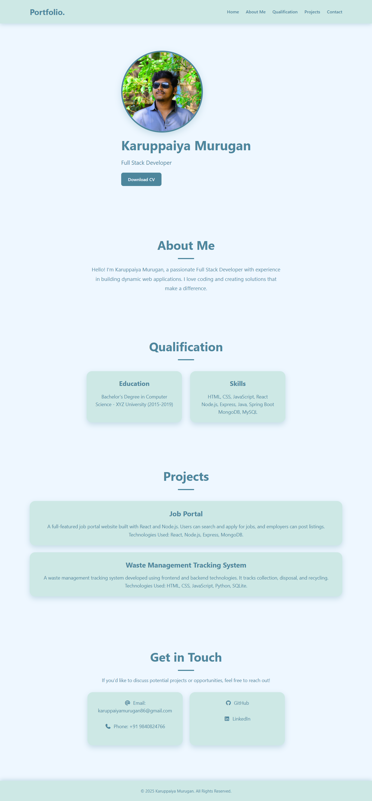

# Karuppaiya Murugan | Full Stack Developer

Welcome to my personal portfolio website! This website showcases my skills, projects, and contact information. Built using **HTML, CSS, and Font Awesome**, it features a clean, modern, and responsive design.

---

## 🌐 Preview

<details>
<summary>Click to preview</summary>

  
*Note: Replace `images/preview.png` with an actual screenshot of your website.*

</details>

---

## 💻 Features

- **Responsive Navbar**: Smooth scrolling to sections
- **Hero Section**: Profile picture with name, title, and CV download
- **About Section**: Brief introduction
- **Qualification Section**: Education and skills
- **Projects Section**: Highlights of major projects
- **Contact Section**: Email, phone, GitHub, and LinkedIn links
- **Footer**: Copyright information
- Fully responsive for mobile, tablet, and desktop

---

## 🛠 Technologies Used

- HTML5
- CSS3
- Font Awesome icons
- CSS Flexbox & Grid for layouts
- Responsive design with media queries

---

## 🚀 How to Use

1. Clone the repository:
```bash
git clone https://github.com/karuppaiya-dev/your-portfolio.git
